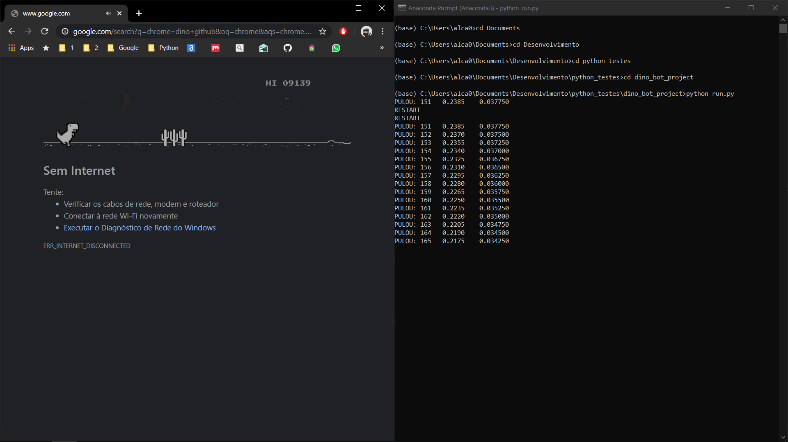

# Chrome Dino Bot

A Python Project of a robot to control the Dino Easter Egg of Google Chrome


### Prerequisites
    * Python
    * package PIL
    * package Numpy
    * package Matplotlib
    * package Pyautogui
    * Google Chrome


### Installing

I don't know if it is possible yet
```
pip install dino-bot
```

## Running the tests
```
python run.py
```

## OBS
I set the values to my laptop screen.



Maybe you'll need to change these values

For testing, it would be good if you split your screen with Chrome in left side and terminal in rigth side.


## Authors

* *André Arruda** - *Initial work* - [See my github](https://github.com/andre23arruda)

## Acknowledgments

* My parents and COVID-19 for quarentine time
